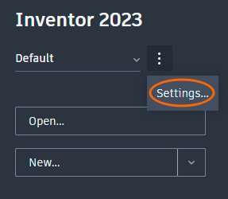
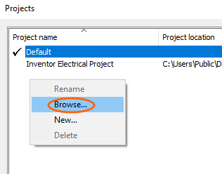

# Inventor configuration

This repository contains Autodesk Inventor configuration and templates for mechanical design aspects of [RespiraWorks](https://respira.works/)' projects. This document  also explains how to install and configure your Inventor to best collaborate with our team.

Why?:
* all of our mechanical designs use the same Inventor configurations, standards and templates
* product parts and assemblies can be viewed and used by external persons/organizations without these configurations

Therefore, this information is stored in this repository, separate from
[Ventilator](https://github.com/RespiraWorks/Ventilator).

This repository constitutes an Inventor "project" - as defined in an `ipj` file. You should use this repository to configure your Inventor to help you collaborate with the team in a synchronized way.

## Getting started

Firstly, we assume that you have installed the most recent version of Inventor Professional. If you need a license, please contact our team on Slack. For joining the team, see the [Ventilator wiki](https://github.com/RespiraWorks/Ventilator/wik).

We also assume that you have installed, configured and at least minimally learned how to use git and git bash. If not, please read the [git setup](https://github.com/RespiraWorks/Ventilator/wiki/git-setup) wiki article.

### Clone repositories.

Select a folder on your system that will be convenient to find via both File Explorer and the command line terminal. This could even be your home directory. Below, wee will assume it is in your home directory.

Open up a Git Bash terminal. Click on `Start`, type "git bash" and hit `Enter`.

Now you can run the following commands:
```shell
git clone git@github.com:RespiraWorks/inventor-config.git respira
cd respira
git clone git@github.com:RespiraWorks/Ventilator.git ventilator
```

And explanation of the above:
* we clone this repository into a directory we call "respira" for convenience of finding and CD-ing into it
* we go into the repository directory and, within it...
* we clone the ventilator repository, also renaming it to lower case for easier typing later

This repository is set up to ignore the `ventilator` subdirectory, so there should be no conflict between the repos on whom the files belong to.

### Initial Inventor configuration

Before you open any files in Inventor, go into `Tools tab` > `Application Options`.
* in the `File` tab, select `Configure Default Template...` and select "millimeters" and "ISO"
* (recommended) in the `Colors` tab, select "Dark" for `UI Theme`.

Now we can open up our project. Do the following:

| 1. On the left pane on the `Home` page | 2. Right click and `Browse...`       |
|----------------------------------------|--------------------------------------|
|   |  |

3. Find the `RespiraWorks.ipj` file wherever you cloned this repository.
4. Click `Done`.
5. Make sure you have the "RespiraWorks" project selected on the `Home` page.

You can now open ventilator design files and work on them.

## What's next?

You have most things configured, but you may want to also read our ["Inventor how-to" wiki](https://github.com/RespiraWorks/inventor-config/wiki). There are a few more potential configuration steps depending on what you will work on. It may also answer some questions you are likely to have on how to use Inventor.

You can now go back to the main [Ventilator wiki](https://github.com/RespiraWorks/Ventilator/wiki) and read the rest of whatever is pertinent to your work.
